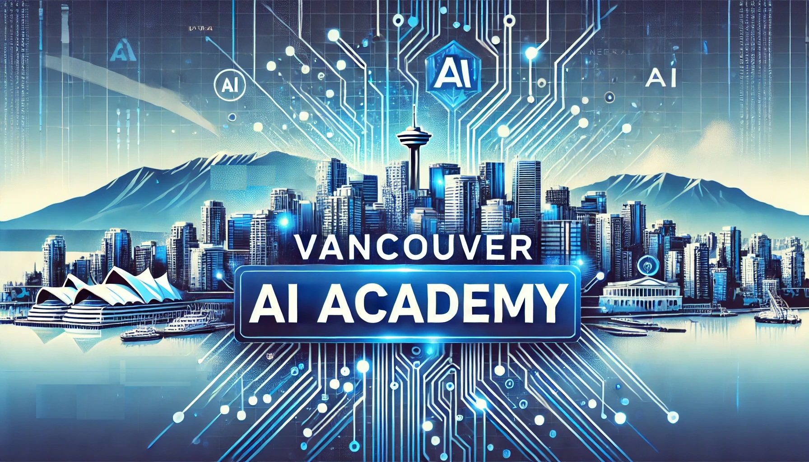

# Vancouver AI Academy (VAA)
## Design, Develop, and Deploy AI Apps with our Collaborative Community

Hello! At VAA, we provide a platform where AI enthusiasts come together to transform ideas into cutting-edge applications through teamwork and shared expertise, taught by [Issam Laradji](https://www.linkedin.com/in/issam-laradji-67ba1a99/).

## Join Our Discord

We do most of our communication here: [discoord](https://discord.gg/Tcsq9AmM)

## Our Approach

We work on different big projects, hold teaching sessions, and organize networking events to support learning and connection. We organize most of our events at [meetup.com](https://www.meetup.com/ai_academy/)

## Learning Material 

| Topic   | Reading List | Quizzes |
|--------|---------------|------------|
| Machine Learning Fundamentals |  - [What is Machine Learning?](https://www.youtube.com/watch?v=ukzFI9rgwfU&pp=ygUhbWFjaGluZSBsZWFybmluZyBvdmVydmlldyAzMCBtaW5z)   - [Train an Image Classifier](https://www.youtube.com/watch?v=k1GIEkzQ8qc&pp=ygUcaW1hZ2UgY2xhc3NpZmljYXRpb24gcHl0b3JjaA%3D%3D)   - [Train a Text Classifier](https://www.youtube.com/watch?v=QEaBAZQCtwE)     - [Train an Image Classifier with Pytorch](https://pytorch.org/tutorials/beginner/blitz/cifar10_tutorial.html)   - [Train a Text Classifier](https://huggingface.co/docs/transformers/en/training) | - [Quiz on Machine Learning](https://academy-ai.github.io/src/quiz_1.html)   - [Implement an Image Classifier](https://github.com/academy-ai/academy-ai.github.io/tree/main/week_1/image_classification)   - [Implement a Text Classifier](https://github.com/academy-ai/academy-ai.github.io/tree/main/week_1/text_classification) |
| Transformers & RAG | - [Finetune Llama-3 locally blog post](https://www.datacamp.com/tutorial/llama3-fine-tuning-locally)   - [Quick RAG](https://medium.com/@akriti.upadhyay/implementing-rag-with-langchain-and-hugging-face-28e3ea66c5f7)     - [Llama-3 Recaptioning](https://arxiv.org/pdf/2406.08478) | - [Quiz on Transformers](https://academy-ai.github.io/src/quiz_2.html)   
| Optimization | - [Backpropagation](https://www.youtube.com/watch?v=3Kb0QS6z7WA) | - [Quiz on Optimization](https://academy-ai.github.io/src/optimization_quiz.html)   

