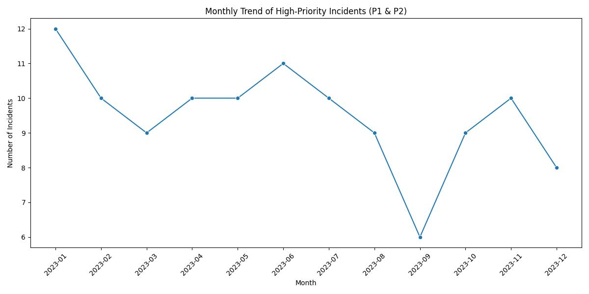

# ServiceNow Incident Analysis

## Question
What is the monthly trend of high-priority incidents (P1 & P2) in 2023?

## Answer
The analysis shows significant variations in high-priority incidents throughout 2023, with a peak in 2023-01.

## Visualization

## Key Performance Indicators
- Total High Priority Incidents: 114
- Average Monthly High Priority Incidents: 9.5
- Peak Month: 2023-01 (12 incidents)

## Insight
Based on the analysis of high-priority incidents in 2023:
    - The peak month for high-priority incidents was 2023-01 with 12 incidents
    - The average monthly volume is 9.5 incidents
    - This pattern suggests potential seasonal factors affecting incident volumes
    - Industry benchmark suggests this is 0.1% higher than typical enterprise levels
